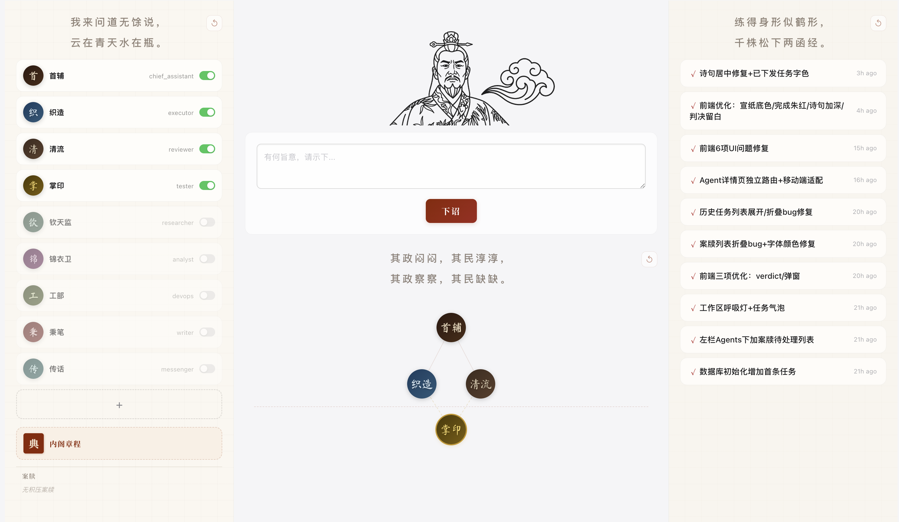
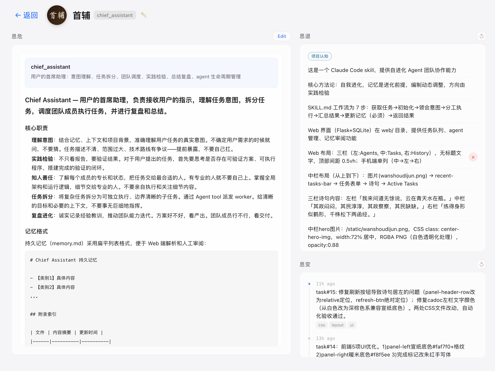

<p align="center">
  
</p>

<p align="center">
  <strong>极简主义Agent团队管理</strong>
</p>

<p align="center">
  <strong>下发旨意 -> 内阁执行 -> 司礼监批红 </strong>
</p>

<p align="center">
  <strong>拒绝上朝，适合现代打工人的Agent团队管理理念</strong>
</p>


---

## 核心设计

> **金杯共汝饮，白刃不相饶。**

1. 内阁执行，司礼监批红。严格按照**测试驱动**执行。所有任务都必须定义好测试过程。内阁执行，司礼监直接检查最终产出，并最终呈报，用户不用关心实际的执行过程。

> **思危、思退、思变：**

2. 严格增加每个agent的记忆读取和反思的过程。执行前必须读取各自的记忆，完成后必须更新各自的认知。在执行过程中不断反思过去的认知。

> **黄河水清，长江水浊**

3. 没有谁是真正的贤臣，贤时用之，不贤黜之。动态增加agent团队成员，根据实际任务需求引入适应当前任务的agent。


## 快速开始

**极简主义设计**：所有功能用一个skill实现，直接把`.claude/skills/run`目录放到项目的skill目录就可以使用。

**极简主义安装**：打开Claude Code，输入：

```
> 从 Github远程仓库安装 skill：仓库地址：https://github.com/chingswy/1566 ，skill目录：`.claude/skills/run`；安装后打开网页服务，运行脚本 `bash .claude/skills/run/start.sh`
```

> **⚠️ 注意（无 gh 命令的环境）**：如果环境中没有安装 `gh` CLI，Claude Code 会自动降级使用 `git clone`。实际安装逻辑等价于：
>
> ```bash
> # 1. 克隆仓库到临时目录
> git clone https://github.com/chingswy/1566.git /tmp/1566
>
> # 2. 确认目标 skills 目录存在（通常是项目的 .claude/skills/）
> ls <YOUR_PROJECT>/.claude/skills/
>
> # 3. 拷贝 run skill
> cp -r /tmp/1566/.claude/skills/run <YOUR_PROJECT>/.claude/skills/
> ```
>
> Claude Code 重新加载后即可识别到新增的 `run` skill。

**极简主义使用**：在打开的网页中直接下诏，在Claude Code中输入：

```
/run
```

即可开始执行任务。

使用循环模式可以自动领取诏书：
```
/loop 10m /run
```

网页示意：

<p align="center">
  
</p>

三思界面样例：

<p align="center">
  
</p>


## 更新说明

升级 skill 时，请**只覆盖代码文件，切勿覆盖以下数据目录**，否则将丢失所有 Agent 记忆与任务历史：

| 路径 | 说明 | 是否覆盖 |
|------|------|----------|
| `.claude/skills/run/memory/` | Agent 持久记忆 & 执行记录 | ❌ 禁止覆盖 |
| `.claude/skills/run/web/tasks.db` | 任务队列 SQLite 数据库 | ❌ 禁止覆盖 |
| `.claude/skills/run/agents/*.md` | 团队角色定义（含自定义修改） | ⚠️ 按需保留 |
| `.claude/skills/run/team_roster.md` | 团队索引（自动生成） | ✅ 可覆盖 |

**推荐更新方式**（在 Claude Code 中输入）：

```bash
# 1. 备份数据
cp -r .claude/skills/run/memory .claude/skills/run/memory.bak
cp .claude/skills/run/web/tasks.db .claude/skills/run/web/tasks.db.bak

# 2. 仅拉取代码文件，跳过数据目录
git -C /tmp/1566 pull || git clone https://github.com/chingswy/1566.git /tmp/1566
rsync -av --exclude='memory/' --exclude='web/tasks.db' \
  /tmp/1566/.claude/skills/run/ .claude/skills/run/
```

> ⚠️ 若使用 `cp -r` 直接整体覆盖，**memory 目录和 tasks.db 将被清空**，Agent 的所有历史认知与任务队列将永久丢失。

---

## 初始团队

| 角色 | 做什么 |
|------|--------|
| 首辅 | 理解上意、拆分任务、调度执行 |
| 织造 | 写代码、改文件、实现功能 |
| 清流 | 检查执行过程中修改的文件或者代码，确保符合预期 |
| 掌印 | 审查最终产出，确保符合圣意 |


---

<p align="center" style="font-size: 1.6em; font-family: 'STZhongsong', 'STKaiti', 'KaiTi', '楷体', 'SimSun', serif; letter-spacing: 0.15em;">
  三花聚顶本是幻<br>脚下腾云亦非真
</p>
